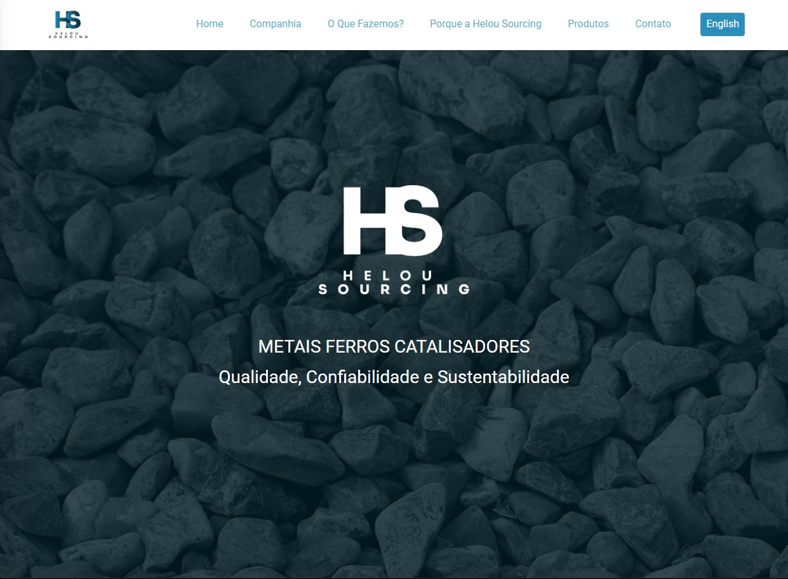
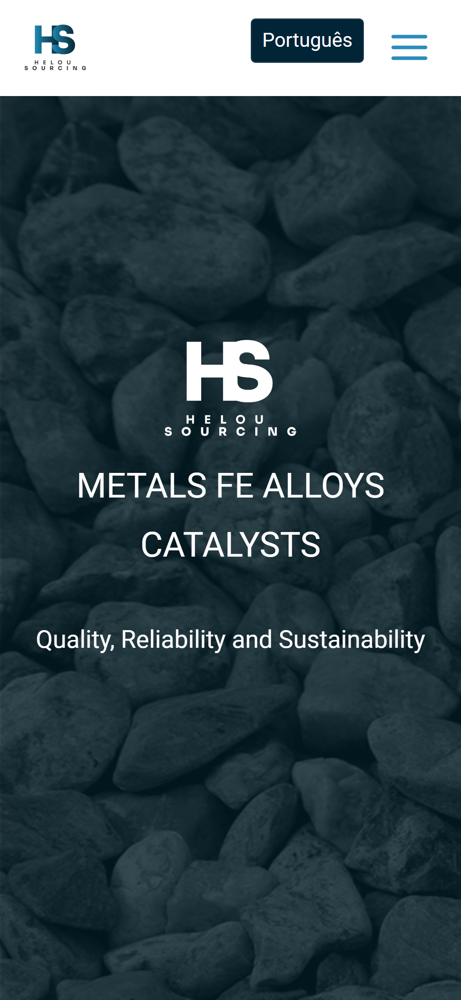
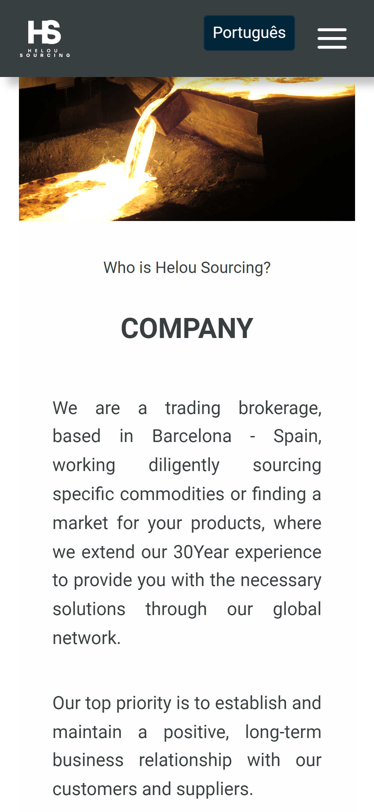
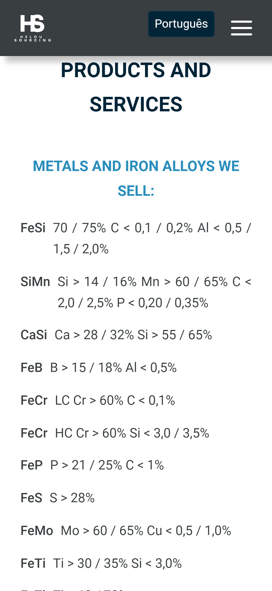
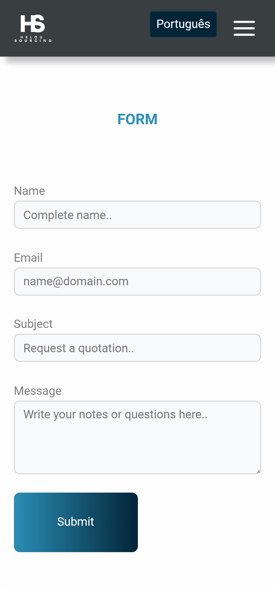
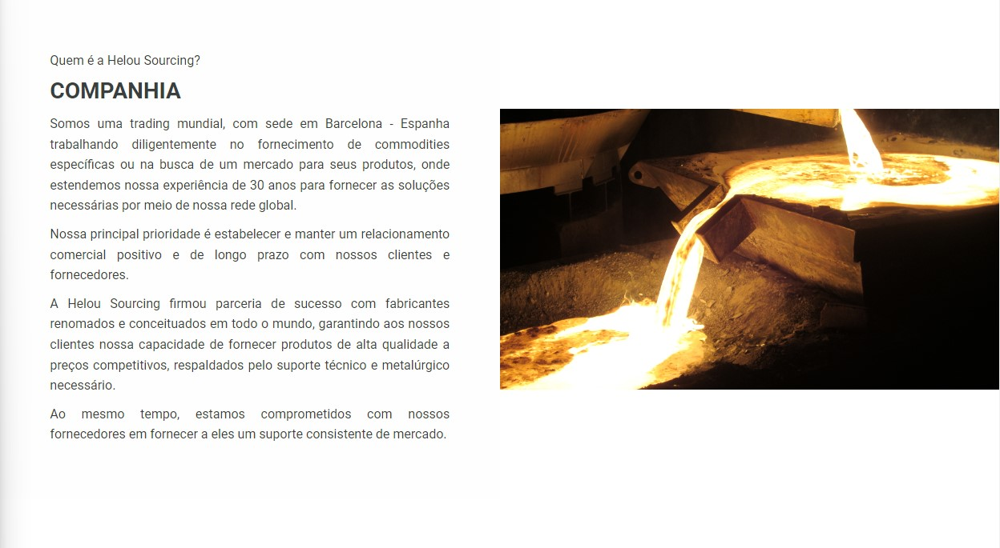
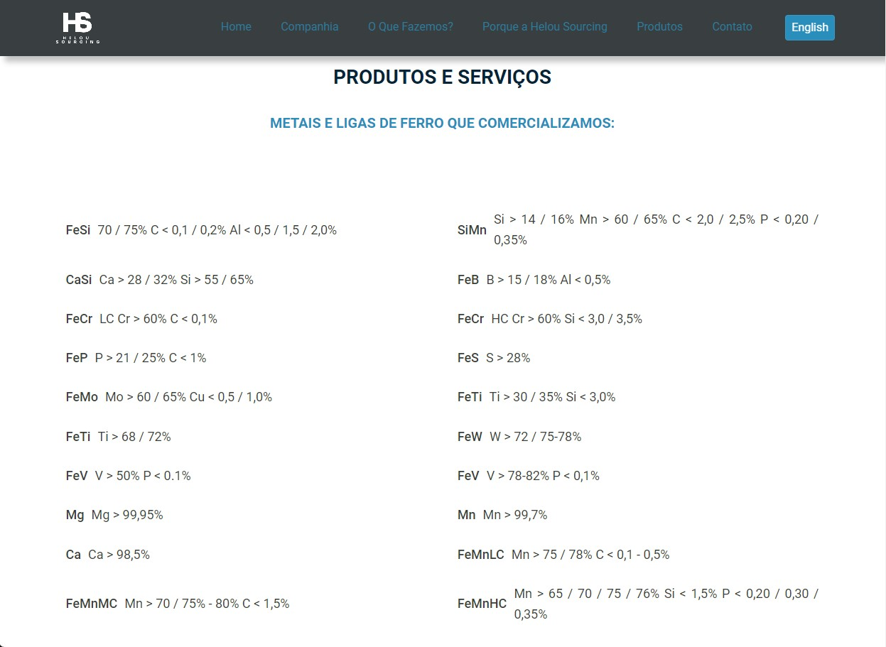
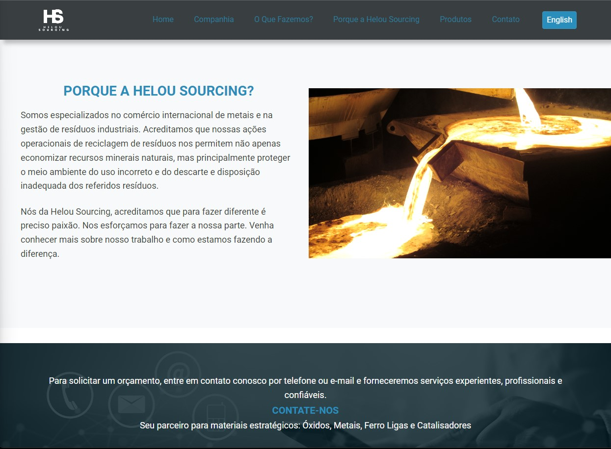
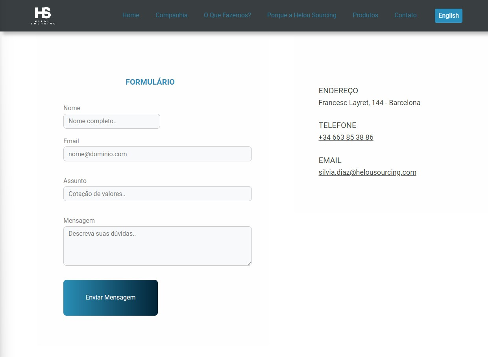

<h1 align="center">
  
</h1>

# Helou Sourcing

<h4 align="center"> 
  Site institucional para uma trading mundial, com sede em Barcelona. <br />
	🚧  Status - Concluído 🚀 🚧
  <br />
  <a href="http://helousourcing.com/" target="_blank">🔗 Acesse o site aqui!
</a>
</h4>


---
## Índice
<br />

- <a href="#-sobre-o-projeto">Sobre</a>
- <a href="#funcionalidades">Funcionalidades</a> 
- <a href="#-layout">Layout</a>
- <a href="#-como-executar-o-projeto">Como executar o projeto localmente</a>
- <a href="#-tecnologias">Tecnologias</a> 
- <a href="#-autor">Autor</a>
---

## 💻 Sobre o projeto

Projeto desenvolvido com o intuito de repaginar o site que estava bastante desatualizado. Também foi essencial para o projeto o botão para troca de idioma entre Inglês e Português! ❤️❤️❤️

---

## ⚙ Funcionalidades

- [x] Botão de Idioma
- [x] Quem é a a Companhia Helou Sourcing?
- [x] O que fazemos?
- [x] Produtos e Serviços
- [x] Porque a Helou Sourcing?
- [x] Formulário de contato
---

## 🎨 Layout 

Como ficou o layout da aplicação:


## 📱 Mobile

<p align="center">

  

  

  

  
</p>

### 💻 Web

<p align="center">

  

  

  

  
</p>

---

## 🚀 Como executar o projeto

Este projeto possui apenas o Frontend

Antes de começar, você vai precisar ter instalado em sua máquina as seguintes ferramentas:

- [Git](https://git-scm.com)<br />
- [Node.js](https://nodejs.org/en/)

Além disto, é bom ter um editor de código para trabalhar com o código como o [VSCode](https://code.visualstudio.com/) .

#### 🎲 Rodando o Frontend 

```bash

#Clone o repositório: 
$ git@github.com:thiago-mfernandes/helou_Sourcing.git

#Acesse a pasta do projeto pelo terminal/cmd
$ cd helou_Sourcing

#Instale as dependências do projeto
$ npm install

#Execute a aplicação em modo de desenvolvimento
$ npm run dev

# O servidor inciará na porta:3000 - acesse http://localhost:3000

```
---

## 🛠 Tecnologias

As seguintes ferramentas foram usadas na construção do projeto:

#### **Website**  

- **[React](https://reactjs.org/)**

- **[Javascript](https://www.javascript.com/)**

- **[Jest](https://jestjs.io/pt-BR/)**

- **[Axios](https://axios-http.com/ptbr/docs/intro)**

- **[Framer Motion](https://www.framer.com/motion/)**

- **[Sass](https://sass-lang.com/)**

#### **Utilitários**

- **[React Icons](https://react-icons.github.io/react-icons/)**


- **[React Anchor Smooth Scroll](https://www.npmjs.com/package/react-anchor-link-smooth-scroll-v2)**


> Veja o arquivo [package.json](https://github.com/thiago-mfernandes/helou_Sourcing/blob/main/helou_Sourcing/package.json)

---

## 🦸 Autor


 
 <br />
 <sub>
  <b>Thiago Fernandes 🚀</b>
 </sub>
 

 
[](https://www.linkedin.com/in/thiago-mello-fernandes-frontend-react-js-javascript/)
---

## 📝 Licença


Feito com ❤️ por Thiago Fernandes 👋🏽 [Entre em contato!](https://whatsa.me/5519984009105)

---
